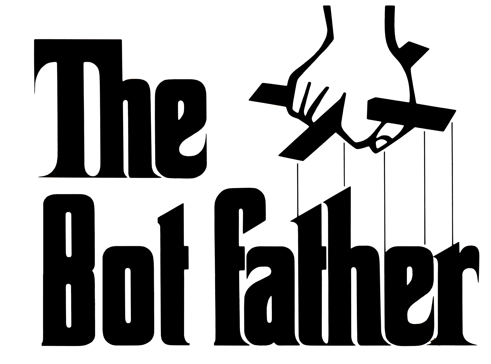

# BotFather
An extension to the Bot Framework that allows bot to bot handoff.

## Architecture

## Setup

- Startup -> Load BotData
- Create appsettings.json with "bot-data": "bot data file url"

## References

- [Bot Builder .NET](https://github.com/Microsoft/botbuilder-dotnet)
