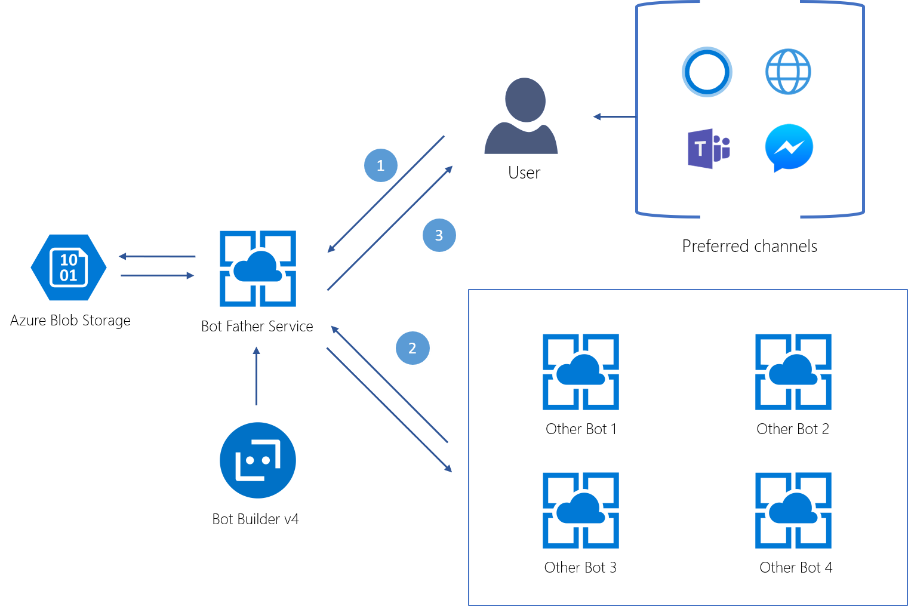

# BotFather
An extension to the Bot Framework that allows bot to bot handoff.

## Architecture

## Setup

- Startup -> Load BotData
- Create appsettings.json with "bot-data": "bot data file url"
- Reference the Bot Father library in your bot

## Using the Bot Father

- To call multiple bots at once, use: **BotFather.StartMultiBotConversation(context)**
- This will call the default Bot Father message, that let's you select the bot you want to talk to
- To exit a conversation with one specific bot, use the keyword exit
- you can switch between bots by using their names, specified in the appsettings.json file

## Edit the messages and control words

- to change the initila message or the specific words used for interacting with the bot, edit the file **BotFather/BotFather.cs** 

## References

- [Bot Builder .NET](https://github.com/Microsoft/botbuilder-dotnet)
